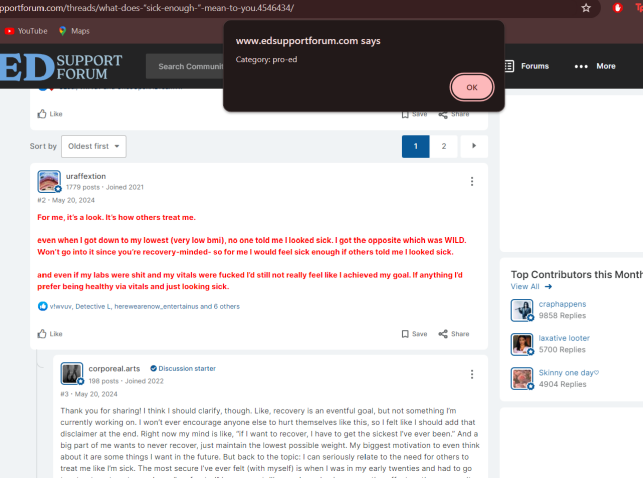

# AI-content-classification-language-model
Browser plugin capable of real-time classification of text related to eating disorders. The plugin utilizes a machine learning model, XGBoost. The development process includes data
preprocessing, feature extraction, model training, and implementing techniques to balance the dataset for improved model performance.
The plugin utilizes a machine learning model, XGBoost. The development process includes data
preprocessing, feature extraction, model training, and implementing techniques to
balance the dataset for improved model performance.

The developed plugin focuses on the issue of detecting content that encourages behaviors associated with eating disorders, i.e., this type of content being dangerous for vulnerable individuals. It involves classifying selected text into three categories. The first category, "pro-ED," includes texts that encourage eating disorders. The second category, "pro-Recovery," includes texts that promote recovery, focusing on overcoming the disorder. The last category, "unrelated," contains texts whose subject is unrelated to eating disorders.
